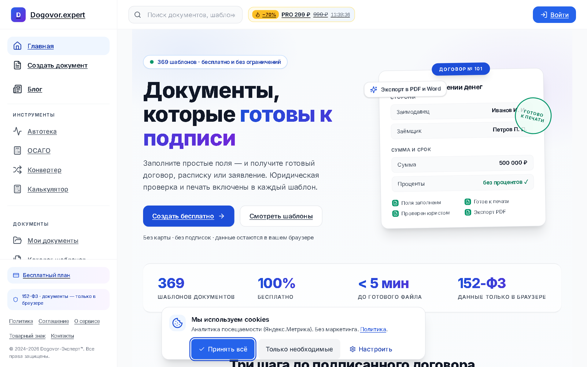
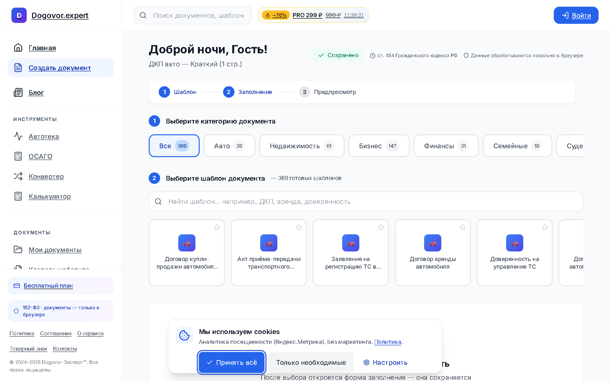
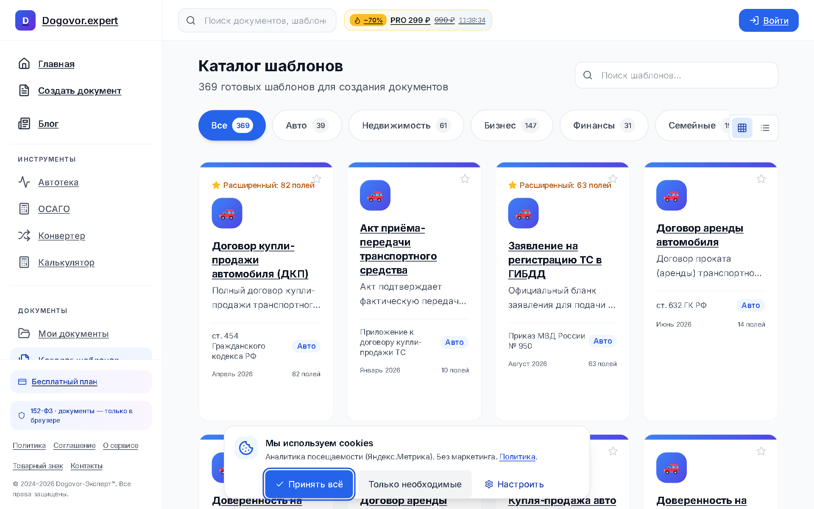
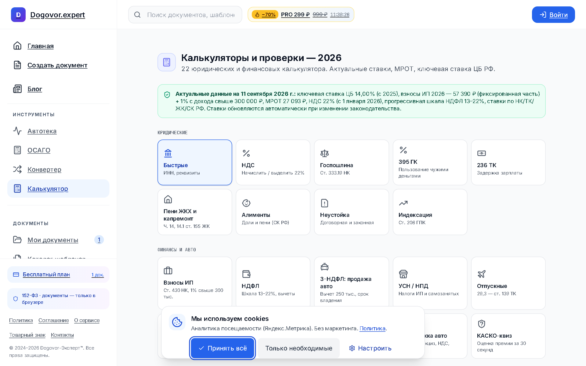
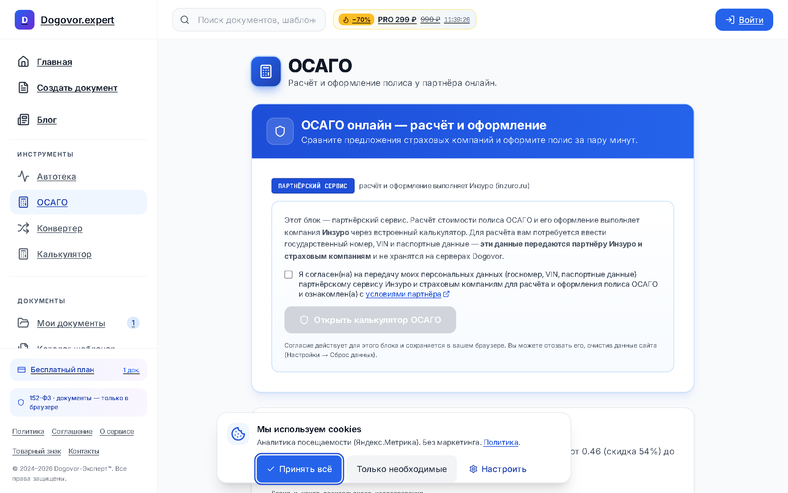

# Dogovor.expert — онлайн-конструктор юридических документов

[**🌐 Открыть сервис: dogovor.expert**](https://dogovor.expert)

Сервис для создания юридически значимых документов дома за 5 минут: договоры, расписки, заявления, жалобы, иски — с автозаполнением, проверкой полей юристом-алгоритмом, экспортом в PDF/DOCX и **квалифицированной электронной подписью (УКЭП) прямо в браузере**.

## Возможности

| | |
|---|---|
| 📄 **Конструктор** | Пошаговое заполнение, автозаполнение по адресу (DaData), live-предпросмотр, экспорт PDF/DOCX, автосохранение с разрешением конфликтов |
| 📚 **369+ шаблонов** | Договоры купли-продажи, аренды, услуг, акты, заявления, жалобы, иски, кадровые и налоговые формы |
| ✍️ **УКЭП в браузере** | PAdES-подписание через КриптоПро, проверка цепочек по TSL Минцифры, CRL/OCSP, метки времени TSA |
| 🔢 **20+ калькуляторов** | Госпошлины НК РФ, пени ст. 395 ГК, отпускные по ПП №540 с премиями, алименты по ПМ 89 регионов, таможня по живому курсу ЦБ, ОСАГО с КБМ (НСИС), производственный календарь с переносами ПП РФ |
| 📷 **OCR и конвертеры** | Текст с фото/сканов, DOCX↔PDF, merge/split PDF, изображения→PDF |
| 🔒 **Приватность** | Шифрование документов нулевого разглашения (AES-GCM), password-protected шеринг, аудит-логи, 152-ФЗ |

## Конструктор и шаблоны

## Калькуляторы

## ОСАГО / КБМ

## Технологии

**Next.js 15** (App Router, RSC) · **React 19** · **TypeScript strict** · **Supabase** (Postgres, RLS, storage) · **Tailwind CSS** · **pdf-lib / pkijs / mammoth** · **Upstash** (rate-limit) · **ЮKassa** · **Vitest** (468 тестов) + **Playwright** e2e · **gitleaks** в pre-commit хуках

Безопасность: CSP с nonce, CSRF-гейты на мутациях, Zod-валидация на всех API-границах, magic-bytes проверка загрузок, перекодирование изображений сервером (sharp), ролевой доступ админки (superadmin/admin/moderator).

## Статус

Продукт в проде, платная подписка, реальные пользователи. Репозиторий с кодом — закрытый; этот репозиторий — публичная витрина продукта.

## Лицензия

© 2024–2026 Dogovor.expert. **All rights reserved.** Материалы и скриншоты этого репозитория защищены авторским правом; копирование и повторная публикация без разрешения правообладателя запрещены.

---

Сделано с ❤️ для юристов и не только · [dogovor.expert](https://dogovor.expert)